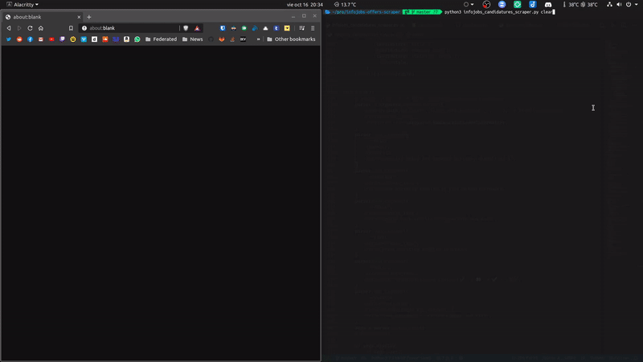
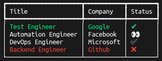
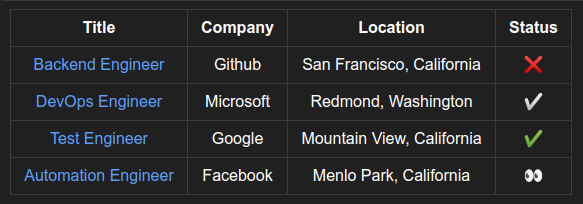
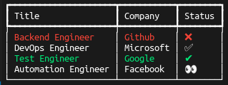

# InfoJobs Candidatures Scraper

A clear view of the status of your candidatures.

<div align="center">
  
</div>

## Table of Contents

- [Motivation](#motivation)
- [Disclaimer](#disclaimer)
- [Features](#features)
- [Usage](#usage)
- [Arguments](#arguments)

## Motivation

InfoJobs does a poor job of showing the _exact_ status of the candidatures,
and the candidatures are sorted by the last time that the company managed
CVs which is not optimal.

I want to have a clear view of the status of my candidatures, and InfoJobs
does a poor job of showing me exactly that, plus the candidatures are sorted
by the last time that the company managed CVs which is not optimal.

## Disclaimer

As InfoJobs heavily blocks automated scraping the solution is kinda hacky,
it entails automating the keyboard to open the source code of the page,
select, and then copy the text. It requires that you're logged in, on your
default browser.

> The default **DELAY** is set to a value that _usually_ does not trigger the
> "are you a robot?" page when there are a lot of candidatures.

## Features

- ### Sort by status

  <ul>
    <div align="center">
      
    </div>
  </ul>

- ### Your candidatures in a single page

  - HTML output
    - The title links to the offer page.
    - The status links to the candidature details page.
    <div align="center">
      
    </div>
  - Terminal output
    <div align="center">
      
    </div>

## Usage

```text
git clone https://github.com/ibLeDy/infojobs-candidatures-scraper.git
cd infojobs-candidatures-scraper
python3 -m virtualenv .venv && source .venv/bin/activate
pip install -r requirements.txt
python infojobs_candidatures_scraper.py
```

## Arguments

```text
--delay DELAY  specific delay for browser actions, default is 2
--display      open existing results in your default browser
--force        ignore past results and generate new ones
--print        print existing results to stdout
--sort         display/print candidatures sorted by status
```

<div align="right">
  <b><a href="#infojobs-candidatures-scraper">↥ back to top</a></b>
</div>
