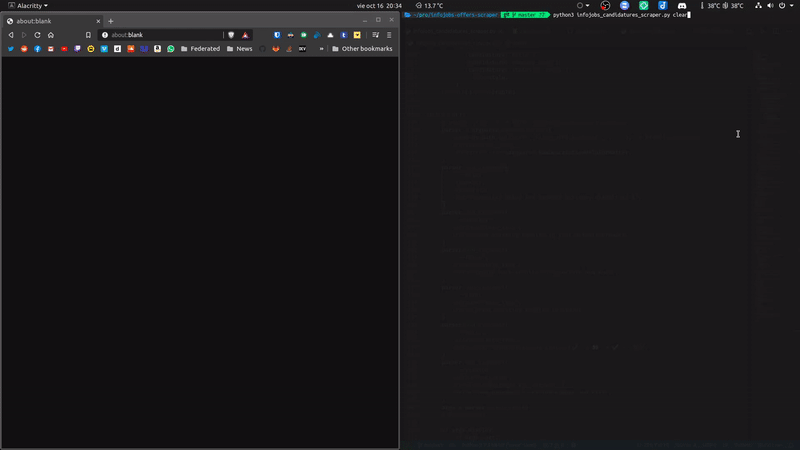

# InfoJobs Candidatures Scraper

<div align="center">
  
</div>

## Disclaimer

As InfoJobs heavily blocks automated scraping the solution is kinda hacky,
it entails automating the keyboard to open the source code of the page,
select, and then copy the text. It requires that you're logged in, on your
default browser.

> The default **DELAY** is set to a value that _usually_ does not trigger the
> "are you a robot?" page when there's a lot of candidatures.

## Usage

```text
python3 -m virtualenv .venv && source .venv/bin/activate
pip install -r requirements.txt
python infojobs_candidatures_scraper.py
```

## Arguments

```text
--delay DELAY  specific delay for browser actions, default is 2
--display      open existing results in your default browser
--force        ignore past results and generate new ones
--print        print existing results to stdout
--sort         display/print candidatures sorted by status
```
